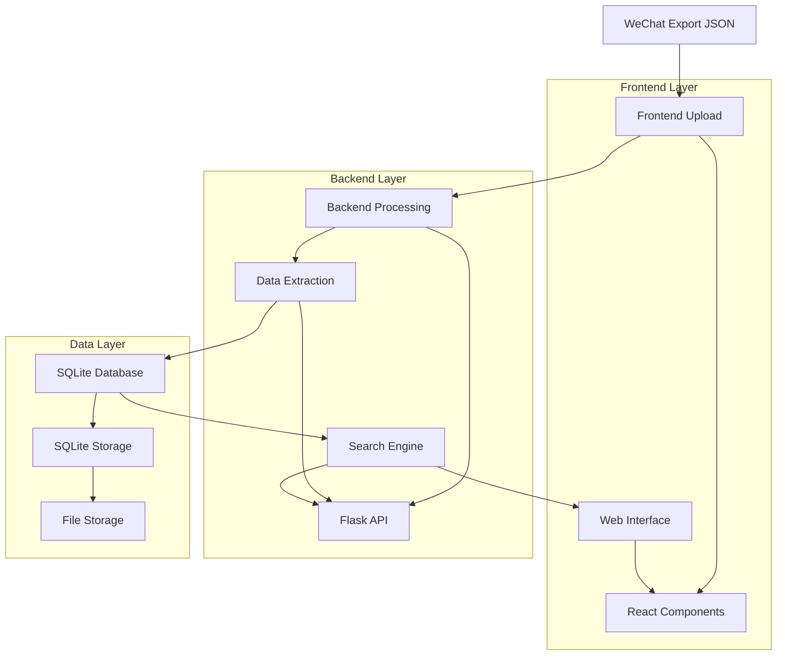

# Chatlog System Architecture Design

## Architecture Overview

**System Type**: Monolithic Web Application (MVP)
**Deployment**: Docker containerized
**Data Flow**: Upload → Process → Store → Search → Display



## System Components

### 1. Frontend Architecture (React + Ant Design)

```
src/
├── components/
│   ├── common/
│   │   ├── Header.tsx
│   │   ├── Footer.tsx
│   │   └── Layout.tsx
│   ├── upload/
│   │   ├── FileUploader.tsx
│   │   └── ProcessingStatus.tsx
│   ├── search/
│   │   ├── SearchBox.tsx
│   │   ├── FilterPanel.tsx
│   │   └── SearchResults.tsx
│   ├── qa/
│   │   ├── QACard.tsx
│   │   ├── QADetail.tsx
│   │   └── QAList.tsx
│   └── admin/
│       ├── CategoryManager.tsx
│       └── DataStatistics.tsx
├── pages/
│   ├── HomePage.tsx
│   ├── SearchPage.tsx
│   ├── DetailPage.tsx
│   └── AdminPage.tsx
├── services/
│   ├── api.ts
│   ├── upload.ts
│   └── search.ts
├── hooks/
│   ├── useSearch.ts
│   └── useUpload.ts
└── utils/
    ├── constants.ts
    └── helpers.ts
```

#### Component Hierarchy
```
App
├── Layout
│   ├── Header
│   └── Footer
└── Routes
    ├── HomePage
    │   ├── SearchBox
    │   └── PopularQA
    ├── SearchPage
    │   ├── SearchBox
    │   ├── FilterPanel
    │   └── QAList
    │       └── QACard[]
    ├── DetailPage
    │   └── QADetail
    └── AdminPage
        ├── FileUploader
        ├── ProcessingStatus
        ├── CategoryManager
        └── DataStatistics
```

### 2. Backend Architecture (Flask + SQLAlchemy)

```
backend/
├── app/
│   ├── __init__.py
│   ├── models/
│   │   ├── __init__.py
│   │   ├── qa.py
│   │   └── category.py
│   ├── routes/
│   │   ├── __init__.py
│   │   ├── api.py
│   │   ├── upload.py
│   │   ├── search.py
│   │   └── admin.py
│   ├── services/
│   │   ├── __init__.py
│   │   ├── extractor.py
│   │   ├── processor.py
│   │   └── search_engine.py
│   └── utils/
│       ├── __init__.py
│       └── helpers.py
├── config.py
├── requirements.txt
└── run.py
```

#### API Layer Structure
```
/api/v1/
├── /upload
│   ├── POST /file          # Upload JSON file
│   └── GET /status/{id}    # Processing status
├── /qa
│   ├── GET /               # List QA pairs
│   ├── GET /{id}          # Get QA detail
│   ├── PUT /{id}          # Update QA
│   └── DELETE /{id}       # Delete QA
├── /search
│   ├── GET /              # Search QA pairs
│   └── GET /suggestions   # Search suggestions
├── /categories
│   ├── GET /              # List categories
│   ├── POST /             # Create category
│   └── PUT /{id}         # Update category
└── /admin
    ├── GET /stats         # System statistics
    └── POST /reindex      # Rebuild search index
```

### 3. Data Layer Architecture

#### Database Schema (SQLite)
```sql
-- 问答对表
CREATE TABLE qa_pairs (
    id INTEGER PRIMARY KEY AUTOINCREMENT,
    question TEXT NOT NULL,
    answer TEXT NOT NULL,
    category_id INTEGER,
    asker VARCHAR(100),
    advisor VARCHAR(100),
    confidence REAL DEFAULT 0.8,
    source_file VARCHAR(255),
    original_context TEXT,
    created_at DATETIME DEFAULT CURRENT_TIMESTAMP,
    updated_at DATETIME DEFAULT CURRENT_TIMESTAMP,
    FOREIGN KEY (category_id) REFERENCES categories(id)
);

-- 分类表
CREATE TABLE categories (
    id INTEGER PRIMARY KEY AUTOINCREMENT,
    name VARCHAR(50) UNIQUE NOT NULL,
    description TEXT,
    color VARCHAR(7) DEFAULT '#1890ff',
    qa_count INTEGER DEFAULT 0,
    created_at DATETIME DEFAULT CURRENT_TIMESTAMP
);

-- 文件上传历史
CREATE TABLE upload_history (
    id INTEGER PRIMARY KEY AUTOINCREMENT,
    filename VARCHAR(255) NOT NULL,
    file_size INTEGER,
    total_messages INTEGER,
    extracted_qa_count INTEGER,
    status VARCHAR(20) DEFAULT 'processing',
    error_message TEXT,
    uploaded_at DATETIME DEFAULT CURRENT_TIMESTAMP
);

-- 搜索历史（可选）
CREATE TABLE search_history (
    id INTEGER PRIMARY KEY AUTOINCREMENT,
    query VARCHAR(255) NOT NULL,
    results_count INTEGER,
    searched_at DATETIME DEFAULT CURRENT_TIMESTAMP
);
```

#### Data Models (SQLAlchemy)
```python
from sqlalchemy import Column, Integer, String, Text, DateTime, Real, ForeignKey
from sqlalchemy.ext.declarative import declarative_base
from sqlalchemy.orm import relationship

Base = declarative_base()

class Category(Base):
    __tablename__ = 'categories'
    
    id = Column(Integer, primary_key=True)
    name = Column(String(50), unique=True, nullable=False)
    description = Column(Text)
    color = Column(String(7), default='#1890ff')
    qa_count = Column(Integer, default=0)
    created_at = Column(DateTime, default=datetime.utcnow)
    
    qa_pairs = relationship("QAPair", back_populates="category")

class QAPair(Base):
    __tablename__ = 'qa_pairs'
    
    id = Column(Integer, primary_key=True)
    question = Column(Text, nullable=False)
    answer = Column(Text, nullable=False)
    category_id = Column(Integer, ForeignKey('categories.id'))
    asker = Column(String(100))
    advisor = Column(String(100))
    confidence = Column(Real, default=0.8)
    source_file = Column(String(255))
    original_context = Column(Text)
    created_at = Column(DateTime, default=datetime.utcnow)
    updated_at = Column(DateTime, default=datetime.utcnow)
    
    category = relationship("Category", back_populates="qa_pairs")
```

## Data Flow Architecture

### 1. Upload & Processing Flow
```
[JSON File] → [Frontend Upload] → [Backend Validation] → [Text Extraction] 
    → [QA Pattern Recognition] → [Data Cleaning] → [Category Classification] 
    → [Database Storage] → [Search Index Update] → [Response to Frontend]
```

### 2. Search & Query Flow
```
[User Query] → [Frontend Search] → [Backend API] → [Search Engine] 
    → [Database Query] → [Result Ranking] → [Response Formatting] 
    → [Frontend Display]
```

### 3. Management Flow
```
[Admin Action] → [Frontend Request] → [Backend Processing] → [Database Update] 
    → [Search Index Update] → [Cache Invalidation] → [Response]
```

## Processing Algorithms

### 1. QA Pattern Recognition Algorithm
```python
def extract_qa_patterns(messages):
    """
    识别问答模式的算法
    """
    patterns = [
        # 直接问答模式
        r'(.+\?)[\s\n]*([^?]+(?:\n[^?]+)*)',
        # 求助回复模式
        r'(求助|请问|咨询)(.+?)[\s\n]*([^求助请问咨询]+)',
        # 标准回复模式
        r'(@\w+\s+)?(.+)[\s\n]*(解答|回复|答案)[:：]\s*(.+)'
    ]
    
    qa_pairs = []
    for message_group in group_consecutive_messages(messages):
        for pattern in patterns:
            matches = re.findall(pattern, message_group, re.MULTILINE)
            if matches:
                qa_pairs.extend(process_matches(matches))
    
    return deduplicate_qa_pairs(qa_pairs)
```

### 2. Auto-Classification Algorithm
```python
def auto_classify_qa(question, answer, categories):
    """
    自动分类算法（基于关键词匹配）
    """
    keyword_map = {
        '产品咨询': ['产品', '功能', '特性', '用途'],
        '技术支持': ['错误', '报错', '不工作', '故障'],
        '价格费用': ['价格', '费用', '成本', '收费'],
        '使用教程': ['怎么', '如何', '步骤', '教程'],
        '售后问题': ['退款', '维修', '更换', '保修']
    }
    
    text = question + ' ' + answer
    scores = {}
    
    for category, keywords in keyword_map.items():
        score = sum(1 for keyword in keywords if keyword in text)
        scores[category] = score
    
    return max(scores.items(), key=lambda x: x[1])[0] if max(scores.values()) > 0 else '其他'
```

## Performance Architecture

### 1. Caching Strategy
```python
# Redis缓存层（可选扩展）
cache_config = {
    'search_results': {'ttl': 300, 'max_size': 1000},
    'popular_qa': {'ttl': 3600, 'max_size': 50},
    'categories': {'ttl': 1800, 'max_size': 100}
}
```

### 2. Search Optimization
```python
# 搜索索引优化
class SearchEngine:
    def __init__(self):
        self.fts_table = 'qa_pairs_fts'  # Full-text search table
        self.index_fields = ['question', 'answer']
    
    def build_search_index(self):
        """构建全文搜索索引"""
        sql = f"""
        CREATE VIRTUAL TABLE {self.fts_table} USING fts5(
            question, answer, category, advisor,
            content_source='qa_pairs'
        )
        """
```

### 3. Performance Targets
- **File Upload**: <30s for 10MB JSON file
- **Search Response**: <2s for any query
- **Page Load**: <1s for search results page
- **Concurrent Users**: Support 50+ simultaneous users

## Security Architecture

### 1. Input Validation
```python
# 文件上传安全
ALLOWED_EXTENSIONS = {'.json'}
MAX_FILE_SIZE = 50 * 1024 * 1024  # 50MB
UPLOAD_FOLDER = '/secure/uploads'

def validate_json_file(file):
    # 文件类型检查
    # 文件大小检查
    # JSON格式验证
    # 恶意内容扫描
    pass
```

### 2. Data Sanitization
```python
def sanitize_text(text):
    """清理用户输入数据"""
    # 移除危险HTML标签
    # 过滤特殊字符
    # 长度限制
    return clean_text
```

## Deployment Architecture

### 1. Docker Configuration
```dockerfile
# Frontend (Nginx + React)
FROM node:16-alpine AS frontend-build
WORKDIR /app
COPY frontend/ .
RUN npm install && npm run build

FROM nginx:alpine
COPY --from=frontend-build /app/dist /usr/share/nginx/html

# Backend (Python + Flask)
FROM python:3.9-slim
WORKDIR /app
COPY backend/ .
RUN pip install -r requirements.txt
CMD ["gunicorn", "run:app"]
```

### 2. Docker Compose
```yaml
version: '3.8'
services:
  frontend:
    build: ./frontend
    ports:
      - "3000:80"
    depends_on:
      - backend
  
  backend:
    build: ./backend
    ports:
      - "5000:5000"
    volumes:
      - ./data:/app/data
      - ./uploads:/app/uploads
    environment:
      - DATABASE_URL=sqlite:///data/chatlog.db
```

## Monitoring & Maintenance

### 1. System Metrics
- Database size and growth
- Upload success/failure rates
- Search query performance
- User activity patterns

### 2. Health Checks
```python
@app.route('/health')
def health_check():
    return {
        'status': 'healthy',
        'database': check_database_connection(),
        'disk_space': get_disk_usage(),
        'memory': get_memory_usage()
    }
```

## Scalability Considerations

### Future Extensions (Post-MVP)
1. **Multi-tenant support**: 多群组支持
2. **Real-time sync**: 实时数据同步
3. **Advanced ML**: 智能问答推荐
4. **API integration**: 微信API直连
5. **Cloud deployment**: AWS/阿里云部署

### Migration Path
```
SQLite → PostgreSQL (for production)
Local storage → Object storage (S3/OSS)
Simple search → Elasticsearch (advanced search)
```